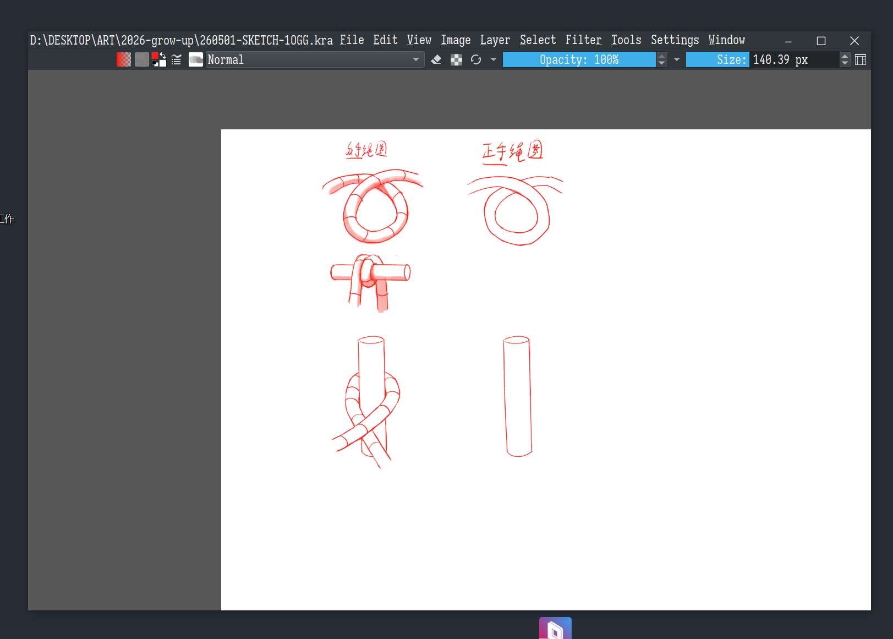

Vibe-coded with deepseek-v4-pro.

# Frameless — Krita Plugin

> [中文版](README_cn.md)

**Not just frameless — the titlebar is fully customizable.** Remove the native Windows titlebar and build your own compact header with any combination of components: document name, menus, spacers, brush size slider, window controls — or your own custom widgets. Drag empty space to move the window, double-click to toggle maximise.

Layout is driven by a simple `config.json` file. Components are modular — drop a new `.py` file into `components/` and register it to add your own.

**Windows 10 / 11 only.** Other operating systems are unaffected (the plugin silently skips non-Windows messages at load time).



## Installation

refer <https://github.com/naer-lily/krita-shortcut-fix>. **A manual restart is required**.

## Visual comparison

```
Native Krita:
┌─────────────────────────────────────────────┐
│  untitled.kra  —  Krita         ─  □  ✕  │  ← native titlebar
├─────────────────────────────────────────────┤
│  File  Edit  View  ...                      │  ← menu bar
├─────────────────────────────────────────────┤
│  canvas                                      │
└─────────────────────────────────────────────┘

Frameless:
┌─────────────────────────────────────────────┐
│  doc.kra  File  Edit  View  ...  ─  □  ✕  │  ← custom titlebar
├─────────────────────────────────────────────┤
│  canvas                                      │
└─────────────────────────────────────────────┘
```

- Current document name shown on the left
- Menus (File, Edit, …) sit inside a real `QMenuBar` — Alt+letter shortcuts, hover-to-switch, and keyboard navigation all work natively
- Empty titlebar space can be dragged to move the window; Aero Snap (half-screen / quarter-screen) works when dragged to a screen edge
- Double-click empty titlebar space to toggle maximise / restore
- Layout is configurable via `config.json` — reorder, remove, or add custom components

### Configuration

Edit `frameless/config.json` to customize the titlebar layout:

```json
{
    "layout": [
        {"name": "CurrentFileName", "config": {"poll_ms": 500}},
        {"name": "OriginalMenuBar", "config": {}},
        {"name": "Spacer",           "config": {}},
        {"name": "WindowControl",   "config": {"button_width": 60}}
    ]
}
```

Components are in `frameless/components/` — each exposes a `create(window, bar_h, config)` factory. To add your own, drop a `.py` file in `components/` and register it in `__init__.py`.

## Technical overview

### Why not `Qt.FramelessWindowHint`

The obvious approach is to call `QMainWindow.setWindowFlags(Qt.FramelessWindowHint)`, but on Windows this changes the underlying HWND to `WS_POPUP` style — which means Windows **stops sending `WM_NCHITTEST` entirely**. Without `WM_NCHITTEST` there is no way to provide resize cursors at window edges or implement edge-drag resizing.

### The correct approach: manual Win32 style manipulation

Our implementation is equivalent to how VS Code / Chrome / Electron handle custom titlebars at the lowest level:

| Step | What | Why |
|------|------|-----|
| 1. Win32 style | Remove `WS_CAPTION` (titlebar), keep `WS_THICKFRAME` (borders) | `WS_THICKFRAME` present → Windows still sends `WM_NCHITTEST` → resize + Aero Snap work |
| 2. DWM frame extension | `DwmExtendFrameIntoClientArea(0, 1, 0, 0)` | Tells the Desktop Window Manager "custom chrome in use" → DWM renders drop shadows |
| 3. `WM_NCCALCSIZE` | Return 0 → client rect = window rect | `WS_THICKFRAME` borders become invisible (0 px wide); window appears borderless |
| 4. `WM_NCHITTEST` | Return `HTLEFT` / `HTRIGHT` etc. for the outer 6 px | Windows shows the correct resize cursor and handles edge-dragging natively |
| 5. `WM_GETMINMAXINFO` | Set max bounds to monitor work area (excluding taskbar) | Maximised window does not cover the taskbar |

### Drag handling

A Qt `mousePressEvent` / `mouseMoveEvent` handler on the custom `_TitleBar` widget starts a window drag on **MouseMove after a 5 px threshold** (not on MousePress — this preserves double-click detection). Button widgets (window controls) are excluded from drag detection.

### Titlebar architecture

The custom titlebar is set as a **TopLeftCorner widget** of the original (cleared) QMenuBar, with a Resize event filter forcing it to full menubar width. Before clearing, all QMenu objects are extracted and migrated into a real `QMenuBar` widget inside the titlebar — preserving Alt+letter shortcuts, hover-to-switch, and keyboard navigation.

Components communicate with the titlebar via a shared `SignalBus` (palette, window state, teardown).

### Krita-specific caveats

Krita's Python API objects (`Window`, `View`, `Document`, etc.) are **ephemeral thin wrappers** — they can be garbage-collected at any time. Never capture their references in signal callbacks or asynchronous code. Menubar mutations are deferred via `QTimer.singleShot(0)` to avoid segfaults.

### File structure

```
frameless/
├── frameless.desktop                     # Krita plugin descriptor
├── frameless/
│   ├── __init__.py                       # Python package entry
│   ├── FramelessExtension.py             # main logic (Win32/DWM + titlebar + entry point)
│   ├── config.json                       # layout configuration
│   ├── components/
│   │   ├── __init__.py                   # component registry + config loader
│   │   ├── filename.py                   # CurrentFileName
│   │   ├── menubar.py                    # OriginalMenuBar
│   │   ├── spacer.py                     # Spacer
│   │   └── window_control.py             # WindowControl
│   ├── krita.pyi                         # Krita Python API type stubs
│   └── Manual.html                       # Krita plugin help page
├── README.md                              # this file (English)
└── README_cn.md                           # Chinese version
```
